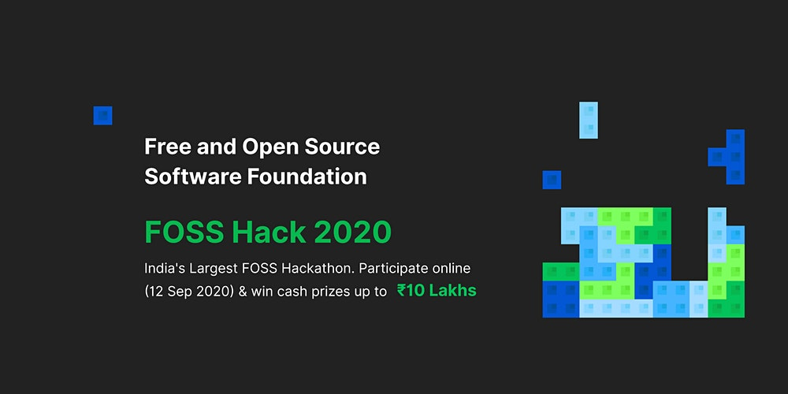
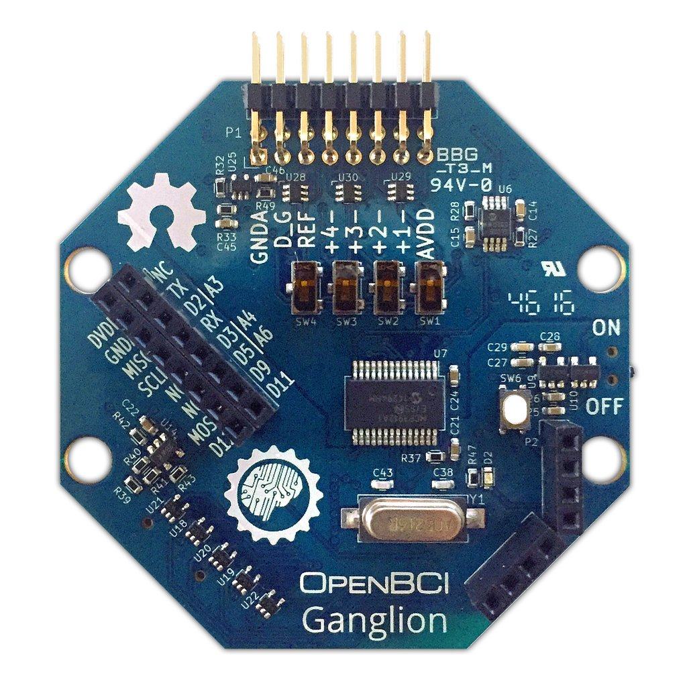
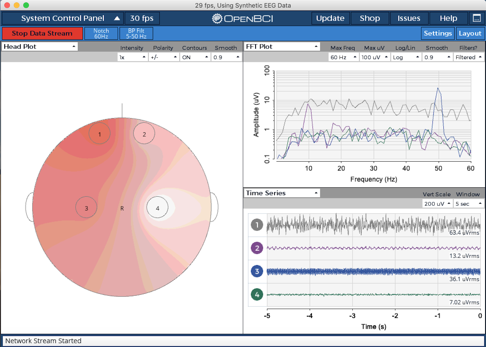
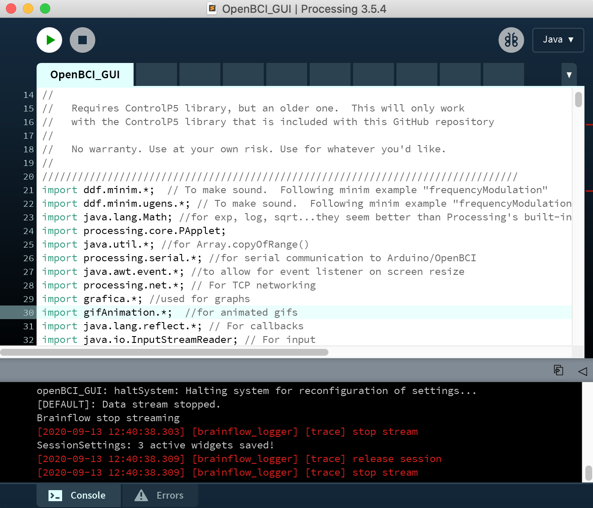
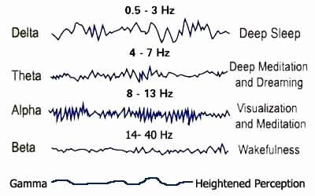

# Foss-Hack-2020

FOSS Hack 2020 is an online hackathon to promote Free and Open Source Software by bringing together students and professionals to build or extend FOSS projects. My submission was a custom application for the OpenBCI Ganglion Board, which is an open source, EEG-based Brain Computer Interface.

# Nirvana

What do Japanese artisans, engineers, Zen philosophy, and cuisine have in common? **Simplicity and attention to detail**. It is not just lazy simplicity but a sophisticated one that searches out new frontiers, always taking the object, the body and mind, or cuisine to the next level, according to ones Ikigai. The Japanese are skilled at bringing nature and technology together— not man vs nature, but rather a union of the two. Meditation generates alpha and theta brain waves right away. It may take half an hour for a beginner to experience them, these relaxing brainwaves are the ones that are activated right before we fall asleep, as we lie in the sun, or right after taking a hot bath. **Nirvana is an interactive app designed to help users achieve deep meditative states by allowing them to visualize their brainwaves using an OpenBCI Ganglion board.** 

OpenBCI specializes in creating low-cost, high-quality biosensing hardware for brain computer interfacing. Their arduino compatible biosensing boards provide high resolution imaging and recording of EMG, ECG, and EEG signals. The OpenBCI Ganglion is a high-quality, affordable bio-sensing device, compatible with OpenBCI's free open-source software. On the input side, there are 4 high-impedance differential inputs, a driven ground (DRL), a positive voltage supply (Vdd), and a negative voltage supply (Vss). Earlier, I was running GUI v4.1.5 when I recorded the 1 hour long meditation session to observe brainwaves in deep meditative states (link is at the bottom of the page). But starting with GUI v5.0.0, the focus widget is temporarily deprecated until a more reliable and research-based Focus algorithm is implemented. The original OpenBCI [repository](https://github.com/OpenBCI/OpenBCI_GUI) is huge, with more than 60 source code files and a dozen other libraries. I am only uploading files relevant to this project, namely OpenBCI_GUI.pde, Widget.pde, WidgetManager.pde and W_template.pde.

GUI widgets in OpenBCI are the mini tools that fit into the OpenBCI GUI’s interface panes. Examples of GUI widgets include the Time Series, the FFT widget, the Networking widget, and so on. In the upper left-hand corner of every widget, there is a dropdown menu that lists all of the available widgets. If you click the dropdown and select a new widget from the dropdown, it will replace the current widget in that window. You can rearrange the layout of the widgets by clicking the “Layout” button in the upper right-hand side of the GUI. Examples include Headplot, FFT Plot and Time Series which are displayed in the above screenshot of our OpenBCI GUI. **Our Nirvana application is implemented as a widget on top of OpenBCI GUI.** The OpenBCI GUI was built using Processing, a popular, Java-based creative coding framework. If you are interested in adding features or modifying the existing code, it is really easy to do so if you are familiar with Java. 

At the root of all our thoughts, emotions and behaviours is the communication between neurons within our brains. Brainwaves are produced by synchronised electrical pulses from masses of neurons communicating with each other. Our brainwaves change according to what we’re doing and feeling. When slower Brainwaves are dominant, we feel slow, tired, sluggish or dreamy. The higher frequencies are dominant when we feel wired or hyper alert. By rule of thumb, anything that changes your perception changes your brainwaves— meditation or recreational drugs. Alpha brain waves are present in deep relaxation and usually emerge when daydreaming or during or at the start of light meditation. It is an optimal time to program the mind for success and it also heightens your imagination, visualization, memory, learning and concentration. The voice of Alpha is your intuition, which becomes clearer and more profound the closer you get to 7.5Hz. Beta waves are associated with normal waking consciousness and a heightened state of alertness, logic and critical reasoning. They are important for effective functioning throughout the day, they also can translate into stress, anxiety and restlessness. The voice of Beta can be described as that nagging little inner critic. As we go into a deeper meditative state, Beta waves start to dominate.

What I have done so far is set up the project directories, processing framework and scripts to convert EEG data format. My wiget template W_template.pde file so far has code directly copy-pasted from the Band Power widget. What I am trying to do is edit the file and extract the Beta waves from the EEG signal and perhaps convert it to a more intuitive form visualization, essentialy to mimic a user approaching a state of "enlightenment." I might as well take ideas from the [EMG widget](https://docs.openbci.com/docs/01GettingStarted/02-Biosensing-Setups/EMGSetup) in which each circle and box represents a channel. The circle and box fill up as the amplitude of the signal on that channel increases (unit in voltage).

# Important links

[OpenBCI Widget Guide](https://docs.openbci.com/docs/06Software/01-OpenBCISoftware/GUIWidgets#custom-widget)

[Video of EEG data from meditation session recorded on 30/10/2019](https://www.youtube.com/watch?v=zz4xVT-fhII&t=1s)

[Running the OpenBCI GUI from the Processing IDE](https://docs.openbci.com/docs/06Software/01-OpenBCISoftware/GUIDocs#running-the-openbci-gui-from-the-processing-ide)

[Download Processing](https://processing.org/download/?processing)